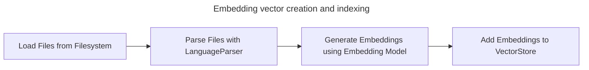
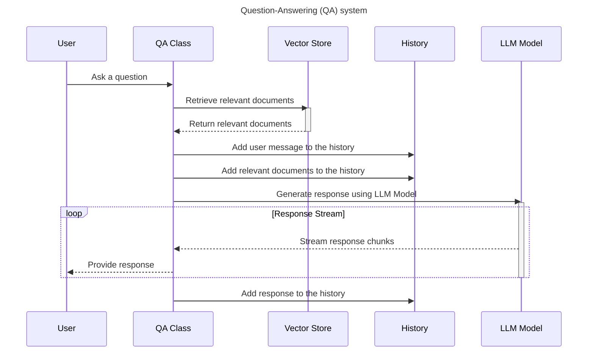

# Talk2Code

This repository contains a Proof of Concept (PoC) for a Retrieval-Augmented Generation (RAG) application, designed to answer user questions about their codebase by leveraging vector-based document retrieval and large language models (LLMs).. It provides the backend and UI for users to ask questions and get responses in real-time.

## System Components

The system consists of two main parts:

1. Embedding vector creation and indexing
2. Question-Answering (QA) system

### Components

1. **Vector Database:** Qdrant vector database that indexes embeddings for each file in the code base.
2. **Embeddings Model:** We use pre-trained `BAAI/bge-large-en-v1.5` model locally over the `Huggingface SentenceTransformers`  to generate embeddings for each file in the code base.
3. **Langchain:** Langchain is used exclusively for embedding vector creation, indexing, and vector retrieval. It is not used in the QA system.
4. **LLM Model:** We use `OpenAI/gpt-4o` model for generating responses to user questions.
5. **FastAPI:** FastAPI is used to create a REST API for the QA system. It uses chunk streaming to provide responses to the user in real-time.
6. **React:** React is used to build the web interface that allows users to interact with the system.

## Embedding vector creation and indexing

The embedding vector creation and indexing component is responsible for creating embeddings for each file in the code base and indexing them in a vector store. The vector store is used by the QA system to retrieve relevant documents based on the user's question.



## Question-Answering (QA) system

The QA system is responsible for answering user questions based on their code base. It retrieves relevant documents from the vector store, generates a response using the LLM model, and streams the response back to the user in real-time.



## Running the System

The repo comes with `https://github.com/langchain-ai/langchain` parsed and indexed in the vector store. You can run the system using the following steps:

### 1. Create an environment file

Create a `.env.docker` file in the `./backend` directory with the following environment variables:

```bash
OPENAI_API_KEY=xxxxxxxx
QDRANT_URL=http://talk2code-qdrant-1:6333  # URL of the Qdrant vector store for docker container
```

### 2. Start the system

Run the following commands to start the system:

```bash
docker compose up --build -d 
```

```bash
[NOTE !]
When you first run the backend container, it downloads the embedding model. This process may take some time depending on your internet connection.
```

### 3. Access the web interface

Open your browser and go to `http://localhost:8080` to access the web interface.
Ask a question related to langchain and see the system in action!
